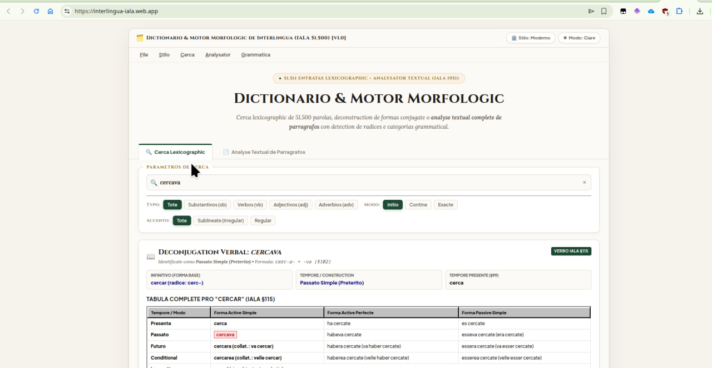
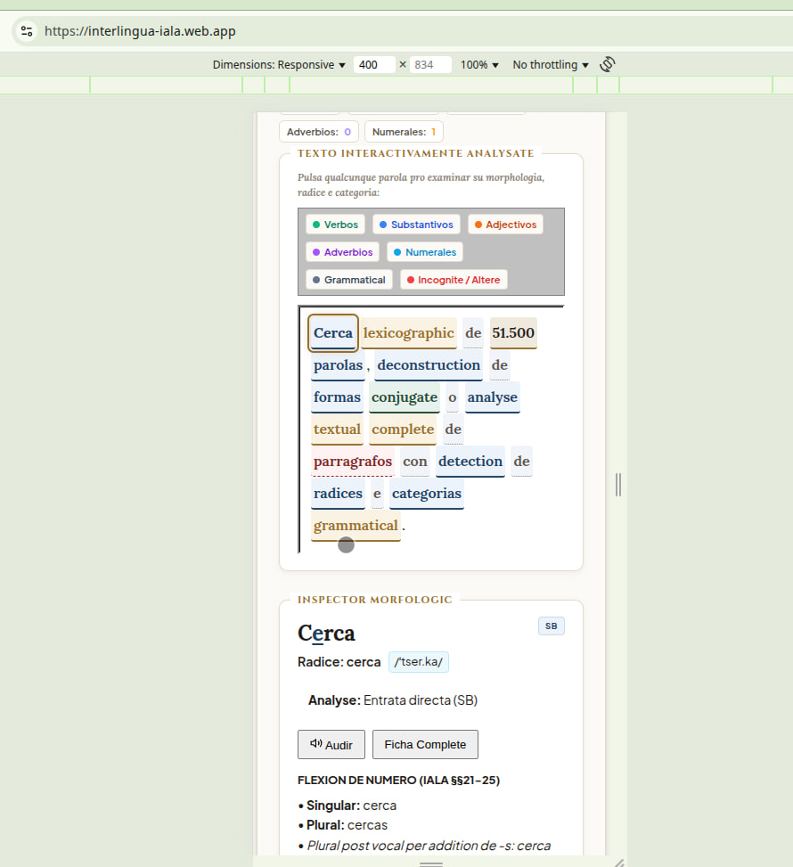
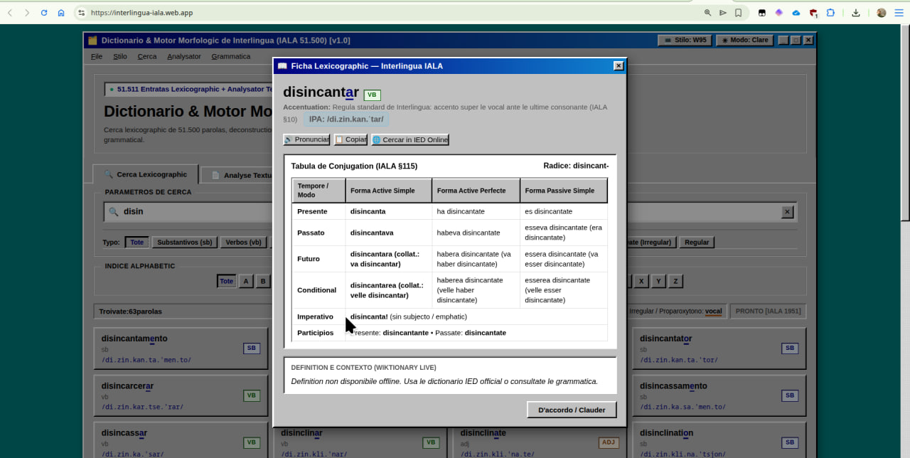

# Dictionario & Motor Morphologic Universal de Interlingua (IALA)

> *«Le thesauro lexicographic e morphologic de Interlingua le plus complete e potente jammais concipite in le universo cognoscite.»*

### Sito Web Official: [https://interlingua-iala.web.app/](https://interlingua-iala.web.app/)

<div align="center">

[](https://github.com/ellerbrock/open-source-badges/)
[](https://opensource.org/licenses/MIT)
[](data.js)
[](src/conjugator.ts)
[](src/assets/Grammatica_de_Interlingua.md)
[](index.html)
[](index.html)

</div>

<div align="center">
  <table>
    <tr>
      <td width="33%" align="center">
        
        <p align="center"><em>Edition Moderne — Bibliotheca & Archivo (Folio de pergamena e auro vetule)</em></p>
      </td>
      <td width="33%" align="center">
        
        <p align="center"><em>Inspection Lexical — Decomposition, transcription IPA e flexion verbal</em></p>
      </td>
      <td width="33%" align="center">
        
        <p align="center"><em>Edition Retro — Windows 95 (Chassis 3D bisellate, barra de menu e palette classic)</em></p>
      </td>
    </tr>
  </table>
</div>

---

## Vision e Manifesto

Iste application non es un simple lista de parolas: es un **monumento computational al lingua auxiliar international Interlingua (IALA)**. Producite e articulate in **Nicaragua**, iste projecto combina un thesauro lexicographic de **51.511 entratas** con un motor de analyse grammatical, derivation, decomposition verbal, resolution de formas collateral, phonetica IPA automatic e synthese de numerales usque al trilliones.

---

## Characteristicas Magistral

### 1. Thesauro Lexicographic de 51.511 Entratas
- Corpus integre e exhaustivitate de indexation a partir del travalio lexicographic de **Piet Cleij** (1927–2015), redigite per Thomas Breinstrup.
- Cerca instantanee (0ms) con indexation per radice, categorias grammatical (POS tags), etymologia e navigatores alphabetic complet.

### 2. Motor Morphologic Universal e Decomposition (IALA §§94–115 & §155)
- **Analyse Verbal Automatic:** Ingressa formas flectite como *cantava*, *scribera*, *funderia* o *viderea*, e le motor determina de forma instantanee le infinitivo primari, le tempore e le paradigma de flexion complete.
- **Participios Passatos Collateral e Classic:** Recognition de formas archaic, classic e collateral (*extraite*, *extracte*, *scripte*, *morte*, *poste*, etc.).
- **Prefixation e Derivation Productive (IALA §155):** Analyse de parolas componite e derivate per prefixos productive (*de-*, *des-*, *re-*, *super-*, *sub-*, etc.) con resolution del radice lexical.
- **Corrector e Suggestion Levenshtein:** Procura intelligente de proximitate orthographic contra le 51.500 parolas in caso de typo o termino non registrate.

### 3. Phonetica e Transcription IPA con Regulas Classic de Accento (IALA §10)
- Transcription phonetica in **Alphabeto Phonetic International (IPA)** in tempore real pro cata entrata e cata forma conjugate o analysate.
- Detection stricte de accentuation secundo le regula general (super le vocal ante le ultime consonante) e exceptiones standard (substantivos e adjectivos in *-le*, *-ne*, *-re*, proparoxytonos in *-ica*, *-ico*, etc., e parolas con hiato o accento irregular marcate con `<u>`).

### 4. Algorithmo de Numeros e Decimales usque al Trilliones (IALA §47)
- Resolution e transcription textual e phonetica de numeros arabic integre, cifras negative e numeros decimal con precision cardinal (de `0` usque a `10^18` con scala *milliardo*, *billion*, *biliardo*, *trillion*).

### 5. Analysator Syntactic e Lector Interactive de Textos
- Pone un paragrapho integre de texto in Interlingua pro obtener un radiographia morphologic completa: division per categorias grammatical colorate, computo de substantivos, verbos, adjectivos, adverbios e numerales, con inspection interactive parola per parola e synthese vocal (TTS).

### 6. Duple Philosophia Esthetica: Moderne & Retro
- **Stilo Moderne (Bibliotheca & Archivo):** Typographia humanista e bibliophile (*Cinzel*, *Lora*, *Plus Jakarta Sans*), umbras de folio de pergamena, tinta carbon, verde lauriero e auro vetule.
- **Stilo Windows 95 (Retro Software):** Fidelitate pixel-perfecte al interfacie classic de 32-bit de Redmond con contornos 3D bisellate, chassis de dialogo, barra de menu con accessos rapide (File, Stilo, Cerca, Analysator, Grammatica) e sonos retro.
- **Modos Clare e Obscur:** Disponibile in ambe stilos con transition instantanee e persistente.

---

## Execution Local

### Requisito:
- Node.js (v18+) pro le ambite de disveloppamento moderne con Vite e TypeScript, o un navigator web moderne con servitor static local.

### Modo de Disveloppamento Moderne (Recommendate: Vite & TypeScript):

Le projecto utilisa nunc **Vite** e **TypeScript** pro le servitor de disveloppamento con Hot Module Replacement (HMR) e verification stricte de typos:

```bash
# Installar dependentias del projecto
npm install

# Lansar le servitor local de disveloppamento (Porto 1951 de IALA)
npm run dev
```

Aperi tu navigator in `http://localhost:1951/` pro executar le application in tempore real.

#### Commandos de verification e compilation:
```bash
# Verification stricte de typos TypeScript (sin generar emissor)
npm run type-check

# Analyse static de codice
npm run lint

# Empaccamento de base pro distribution
npm run build
```

> **Nota super le distribution e publication:**  
> Le commando `npm run build` genera un fasciculo standard compilate e reducite al minimo per medio de Vite in le dossier `dist/`. Si on desira un distribution personalisate con proceduras de reduction aggressive, compression de folios de stilo o transformationes proprietari de securitate e occultation, cata disveloppator pote implementar su proprie script de imballage adaptate a su proprie ambiente e servitor de rete.

### Execution Classic / Servitor Static Alternative:

Pote esser aperite equalmente via un servitor static local simplice:

```bash
# Option 1: Python
python3 -m http.server 3000

# Option 2: Node.js (npx serve)
npx serve -l 3000 .
```

Aperi tu navigator in `http://localhost:3000` (o directemente `index.html`) pro entrar in le thesauro.

---

## Structura del Projecto

```text
DictionarioIALA/
├── index.html                  # Interfacie de usator unificate (Windows 95 + Moderne)
├── package.json                # Definition de scripts e dependentias del projecto
├── tsconfig.json               # Configuration radice del compilator TypeScript
├── vite.config.ts              # Configuration del servitor Vite (porto 1951)
├── firebase.json               # Configuration de allogiamento web Firebase (public: "dist")
├── .firebaserc                 # Identification del projecto de allogiamento Firebase
├── LICENSE                     # Licentia MIT de codice aperte
├── README.md                   # Documento e manifesto del thesauro
├── config/                     # Configurationes de infrastructura, Vite, TypeScript e ESLint
│   ├── vite.config.ts          # Definition de fasciculo e porto del servitor
│   ├── tsconfig.json           # Parametros strict de verification de typos
│   └── eslint.config.js        # Regulas de inspection de codice
└── src/                        # Codice fonte modularisate in TypeScript
    ├── main.ts                 # Puncto de entrata TypeScript del application
    ├── app.ts                  # Logica de interfacie, eventos e vistas
    ├── conjugator.ts           # Motor morphologic, flexion verbal e decomposition
    ├── transcriber.ts          # Transcriptor phonetic e notation IPA (IALA §10)
    ├── tts.ts                  # Client de synthese vocal e cache local IndexedDB
    ├── env.ts                  # Configuration de ambiente e endpoint del worker TTS
    ├── assets/                 # Folios de stilos (style.css), graphicos e grammatica
    │   ├── style.css           # Systema de stilos duple (Bibliotheca & Windows 95)
    │   └── Grammatica_de_Interlingua.md # Grammatica official de IALA
    ├── components/             # Componentes de UI modular (AudioConfigModal.ts)
    ├── config/                 # Configurators de ambiente runtime
    ├── data/                   # Thesauro lexicographic de 51.511 parolas
    │   └── data.js             # Base de datos lexicographic de Cleij & Breinstrup
    └── types/                  # Definitiones de typos e interfaces TypeScript
```

---

## Creditos & Licentia

- **Disveloppator del Motor Morphologic & Interfacie:** [Walter García](https://github.com/Walter-Synapse) (Nicaragua).
- **Thesauro Lexicographic:** Piet Cleij (1927–2015), redigite per Thomas Breinstrup.
- **Fundamento Grammatical:** *Grammatica de Interlingua* (Alexander Gode & Hugh E. Blair, International Auxiliary Language Association - IALA).
- **Traduction al Interlingua:** Selahattin Kayalar (2005, Union Mundial pro Interlingua - UMI).
